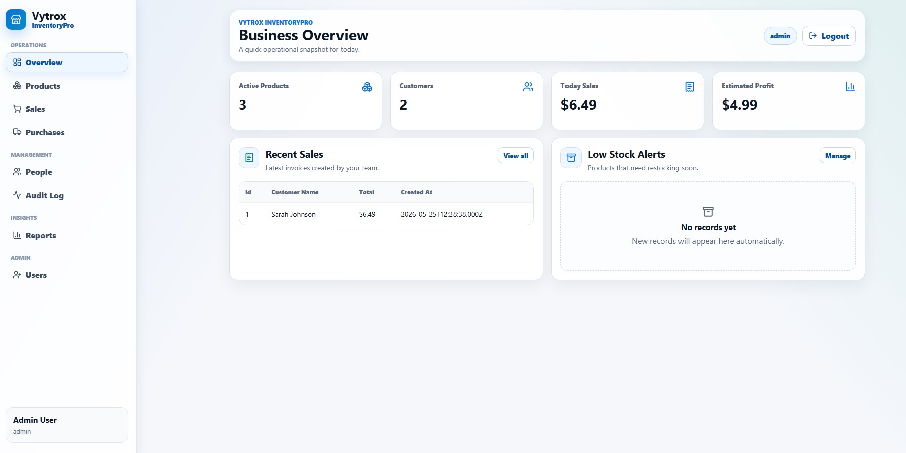
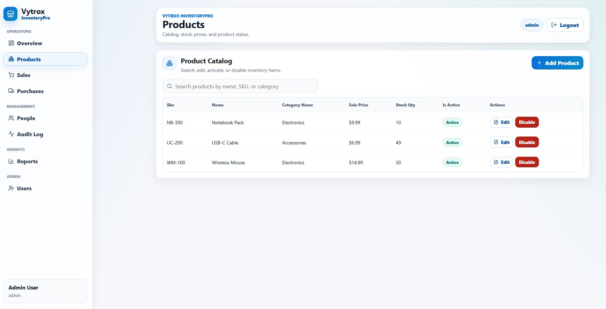
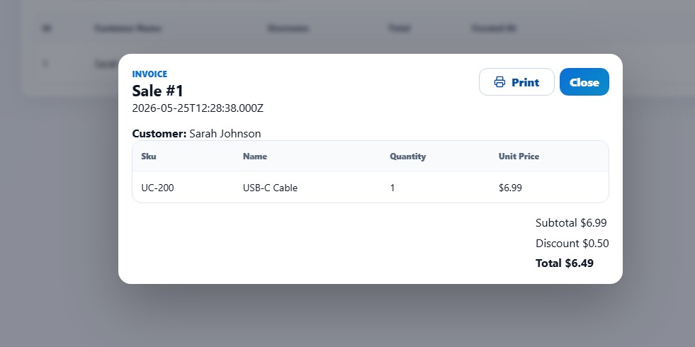
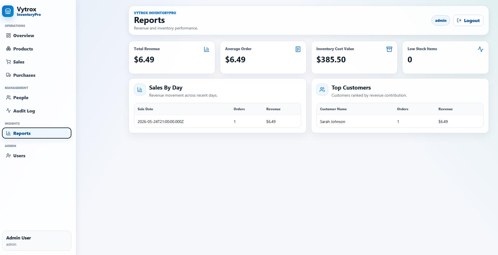

# Vytrox InventoryPro

A full-stack inventory and sales management system built as a production-style portfolio project.

Vytrox InventoryPro helps small teams manage products, stock, purchases, sales invoices, customers, suppliers, staff accounts, reports, and inventory audit logs from one dashboard.

## Tech Stack

- Frontend: React + Vite
- Backend: Node.js + Express
- Database: MySQL Community Server
- Auth: JWT + hashed passwords
- UI: Custom CSS design system + Lucide icons
- Security: Role-based access control, rate limiting, Helmet, prepared SQL queries

## Main Features

- Login with three demo roles: Admin, Inventory Manager, Cashier
- Product catalog with search, edit, activate, and disable actions
- Sales invoices that automatically decrease stock
- Purchase records that automatically increase stock
- Printable sales invoice modal
- Customers, suppliers, and categories management
- Staff user creation and admin password reset
- Dashboard metrics and low-stock alerts
- Reports for revenue, average order, inventory value, top customers, and sales by day
- Inventory movement audit log
- MySQL transactions for stock-sensitive operations

## Screenshots

### Overview



### Products



### Invoice



### Reports



## Demo Accounts

| Role | Username | Password |
| --- | --- | --- |
| Admin | `admin` | `Admin@123` |
| Inventory Manager | `inventory` | `Inventory@123` |
| Cashier | `cashier` | `Cashier@123` |

## Quick Start

Clone the repository and enter the project folder:

```bash
git clone https://github.com/H-crowe/vytrox-inventorypro.git
cd vytrox-inventorypro
```

Install dependencies:

```bash
npm install
npm run install:all
```

Create the backend environment file:

```bash
copy backend\.env.example backend\.env
```

Create database tables and seed demo data:

```bash
npm run db:setup --prefix backend
npm run seed --prefix backend
```

Start the project:

```bash
npm run dev
```

Open:

```text
http://localhost:5173
```

API health check:

```text
http://localhost:4000/api/health
```

Expected response:

```json
{"ok":true}
```

## MySQL Notes

This project uses MySQL syntax, not Microsoft SQL Server syntax.

The schema file is:

```text
backend/database/schema.sql
```

The setup script is:

```text
backend/setup-db.js
```

What each file does:

- `schema.sql`: Defines database tables and relationships.
- `setup-db.js`: Creates the database and imports the schema.
- `seed.js`: Adds roles, demo users, products, customers, and suppliers.

If VS Code shows `mssql` syntax errors in `schema.sql`, change the file language mode from MSSQL to MySQL or plain SQL.

## Local MySQL Startup

If MySQL is not running, start your local MySQL server first. On Windows, this is usually done from the MySQL service, MySQL Notifier, or Services app.

Then run the project:

```bash
npm run dev
```

## Daily Development

After the database has already been created and seeded, the usual startup is:

```bash
cd vytrox-inventorypro
npm run dev
```

If the database is not responding, start MySQL first using the command above.

## Architecture

```text
React Dashboard
      |
      v
Express REST API
      |
      v
MySQL Database
```

## Project Structure

```text
inventory-sales-system/
  backend/
    src/
      db.js          # MySQL connection pool
      middleware.js  # Auth, permissions, async handler, errors
      routes.js      # API endpoints
      services.js    # Business logic and transactions
      validators.js  # Validation and sanitizing helpers
      server.js      # Express app setup
    database/
      schema.sql     # MySQL schema
    setup-db.js      # Creates database and imports schema
    seed.js          # Demo roles, users, and sample data
    server.js        # Backend entrypoint
  frontend/
    src/
      main.jsx       # React dashboard and page components
      styles.css     # Custom SaaS-style dashboard UI
  README.md
```

## Request Flow

```text
User action in React
  -> fetch request with JWT token
  -> Express route
  -> auth and role middleware
  -> service or SQL query
  -> MySQL transaction when stock changes
  -> JSON response
  -> React refreshes dashboard data
```

## Security Model

- Passwords are never stored or displayed in plain text.
- Passwords are hashed with `bcryptjs`.
- Admins can reset passwords but cannot view existing passwords.
- JWT protects API routes.
- Role permissions protect inventory, sales, and admin actions.
- Prepared SQL queries reduce SQL injection risk.
- Sales and purchases use transactions to keep stock consistent.

## API Overview

| Area | Endpoints |
| --- | --- |
| Auth | `POST /api/login` |
| Dashboard | `GET /api/dashboard`, `GET /api/reports` |
| Products | `GET /api/products`, `POST /api/products`, `PUT /api/products/:id`, `DELETE /api/products/:id` |
| Sales | `GET /api/sales`, `POST /api/sales`, `GET /api/sales/:id` |
| Purchases | `GET /api/purchases`, `POST /api/purchases` |
| People | `GET/POST /api/customers`, `GET/POST /api/suppliers`, `GET/POST /api/categories` |
| Users | `GET /api/users`, `POST /api/users`, `PUT /api/users/:id/password` |
| Audit | `GET /api/movements` |

## GitHub Notes

The database data directory is ignored by Git:

```text
backend/database/mysql-data/
```

Only the schema and seed scripts are committed, so anyone can recreate the database locally.

## License

This project is licensed under the MIT License.

Copyright (c) 2026 Vytrox.
